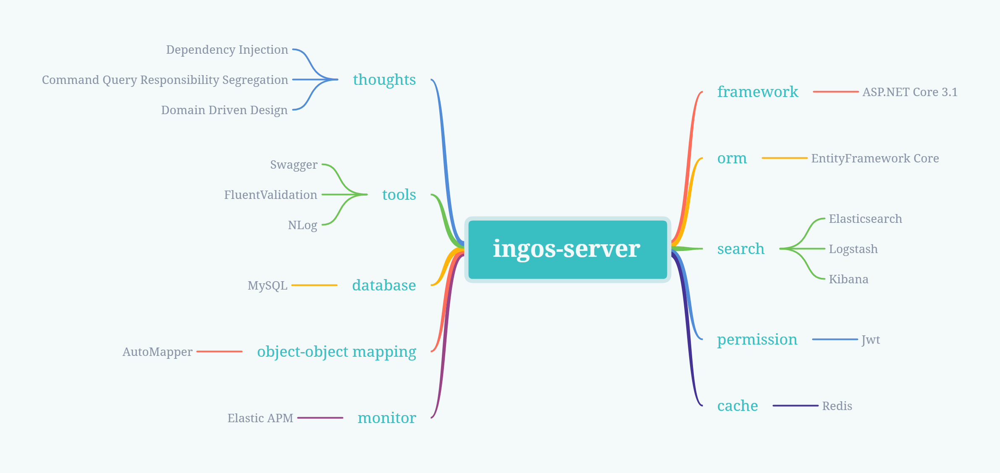

# ingos-server

a product management software's back-end api project which adopt ddd and cqrs thoughts and based on asp.net core web api.

# Get started

ingos-server is based on .NET Core 3.1, so if you want to develop based on this repository, make sure to include all the following requirements item.

# Requirements

- IDE and SDK
  - Visual Studio 2019 or Visual Studio Code
  - .NET Core 3.1
- Database
  - MySQL 8.0
  - Redis
- ELK Stack
  - Elasticsearch
  - Logstash
  - Kibana
  - Elastic APM
- Docker

# Technologies

# License

The **ingos-server** was developed by [Danvic Wang](https://github.com/Lanesra712 "Danvic Wang") and under the [MIT License](/LICENSE "MIT License").
